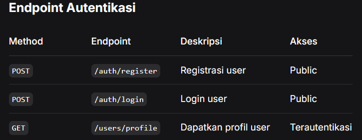
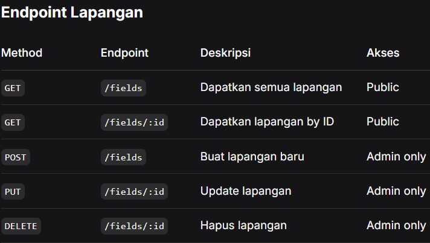
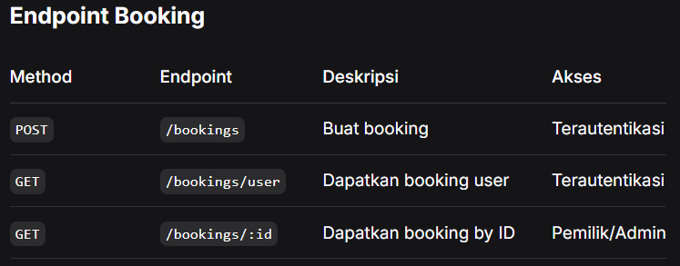
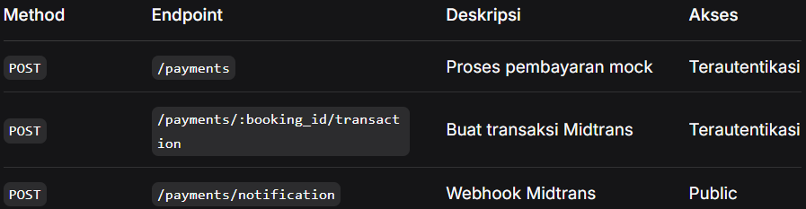

# Home-TestSistem Booking Lapangan Olahraga - Backend API

API RESTful lengkap untuk sistem booking lapangan olahraga yang dibangun dengan Golang, Fiber, PostgreSQL, dan JWT authentication. Project ini merupakan implementasi dari Take Home Test untuk posisi Backend Engineer Intern di PT Sagara Asia Teknologi.

# Fitur yang Diimplementasi

- Autentikasi & Otorisasi - JWT dengan akses berbasis role (User/Admin)
- Operasi CRUD lengkap untuk lapangan (Admin only)
- Booking pintar dengan validasi waktu overlap
- Payment gateway Midtrans dengan webhook support
- Kontainerisasi lengkap dengan PostgreSQL
- Automated testing dan deployment dengan GitHub Actions
- Dokumentasi Swagger/OpenAPI lengkap

# Tech Stack

- Backend: Go 1.24.2 + Fiber Framework
- Database: PostgreSQL 15+
- Authentication: JWT dengan role-based access
- Payment: Integrasi Midtrans
- Container: Docker & Docker Compose
- CI/CD: GitHub Actions
- Documentation: Swagger/OpenAPI

# Persyaratan

- Go 1.24.2+
- PostgreSQL 15+
- Docker & Docker Compose (opsional)

# Mulai

Development Lokal

# Clone repository

git clone https://github.com/TambunanMagdalena/Home-Test.git
cd Home-Test

# Salin file environment

cp cmd/.env.example cmd/.env

# Edit .env dengan konfigurasi Anda

nano cmd/.env

# Install dependencies

go mod download

# Jalankan aplikasi

go run cmd/main.go

Konfigurasi Environment
Buat file cmd/.env berdasarkan cmd/.env.example:

# Konfigurasi Database

DB_POSTGRES_HOST=localhost
DB_POSTGRES_PORT=5432
DB_POSTGRES_NAME=main
DB_POSTGRES_USER=postgres
DB_POSTGRES_PASSWORD=password_anda
DB_POSTGRES_SCHEMA=take_home

# Konfigurasi JWT

JWT_SECRET=secret-key-jwt-anda-min-32-karakter

# Konfigurasi Service

SERVICE_ENVIRONMENT=development
SERVICE_PORT=3005
HTTP_HOST=http://localhost:3005

# Konfigurasi Midtrans (Sandbox)

MIDTRANS_SERVER_KEY=SB-Mid-server-key-anda
MIDTRANS_CLIENT_KEY=SB-Mid-client-key-anda
MIDTRANS_ENVIRONMENT=sandbox

# Swagger UI
http://localhost:3005/swagger/

📚 Dokumentasi API
Endpoint Autentikasi

Endpoint Lapangan

Endpoint Booking

Endpoint Pembayaran

🔐 Role Default

- User: Dapat membuat booking dan melihat data sendiri
- Admin: Dapat mengelola lapangan dan melihat semua booking
  Registrasi user dengan role berbeda:

// Admin User
{
"name": "Admin User",
"email": "admin@test.com",
"password": "password123",
"role": "admin"
}

// Regular User
{
"name": "Test User",
"email": "user@test.com",
"password": "password123",
"role": "user"
}

📁 Struktur Project
take-home-test/
├── cmd/
│ ├── main.go # Entry point aplikasi
│ ├── init_env.go # Inisialisasi environment
│ └── .env.example # Template environment
├── app/
│ ├── controllers/ # HTTP controllers
│ ├── models/ # Data models
│ ├── repositories/ # Operasi database
│ ├── usecases/ # Business logic
│ ├── constants/ # Konstanta aplikasi
│ ├── helpers/ # Utility functions
│ └── routes/ # API routes
├── pkg/
│ ├── config/ # Manajemen konfigurasi
│ ├── database/ # Koneksi database
│ ├── middleware/ # HTTP middleware
│ └── payment/ # Integrasi payment gateway
├── .github/
│ ├── workflows/ # CI/CD pipelines
│ └── sql/ # Inisialisasi database
├── docs/ # Dokumentasi API
├── Dockerfile
├── docker-compose.yml
├── go.mod
└── README.md

Database Migrations
Aplikasi menggunakan GORM auto-migration. Tables dibuat otomatis saat startup.

👥 Author
Magdalena Pebriany Tambunan
